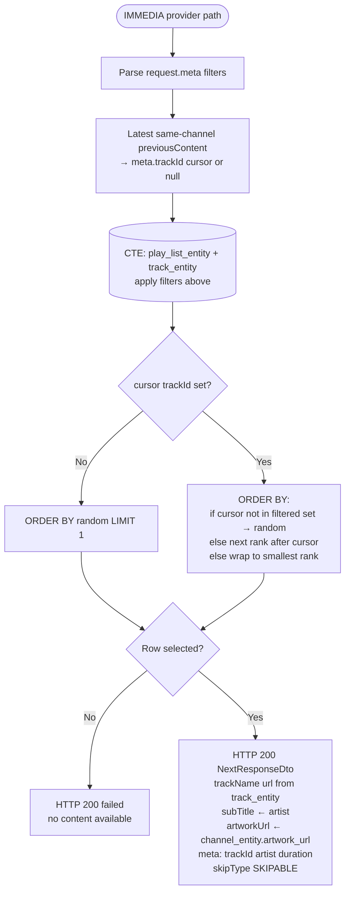

# Project Specification: NestJS API Phase 1
```
Hello World

```

## Tech Stack
- Framework: NestJS (Standard CLI structure)
- ORM: MikroORM with PostgreSQL Driver (@mikro-orm/postgresql)
- Validation: class-validator & class-transformer
- Documentation: Swagger UI (@nestjs/swagger)
- Configuration: @nestjs/config (using .env)



## Architectural Constraints

- Structure: Simple module-based architecture under src/modules.
- Database: Connect to an existing PostgreSQL instance. Note: Do not generate or run migrations in this repo; migrations are managed externally.
- Global Prefix: All routes should be prefixed with /api/v1.

## Feature Requirements
1. Health Monitoring
  - Endpoint: GET /health
  - Function: Returns a 200 OK with { "status": "ok", "timestamp": "..." }.
2. Next Content Service
  - Endpoint: POST /next
  - Request DTO:
    - previousContent: An array of objects.
    -contentType: Enum ["imm_channel", "ext_stream"].
    - id: String (UUID format).
    - meta: Object (flexible record).
  - Response (Hardcoded for Phase 1):
```
JSON
{
  "contentType": "imm_channel",
  "id": "550e8400-e29b-41d4-a716-446655440000",
  "name": "Hardcoded Channel",
  "subTitle": "Now Playing",
  "url": "https://example.com/stream",
  "artworkUrl": "https://example.com/image.png",
  "meta": {}
}
````

##Cursor / AI Instructions
Style: Use strict TypeScript. Use async/await for all controller and service methods.

DTOs: Use class-validator decorators for all input fields.

Swagger: Use @ApiProperty() and @ApiOperation() decorators to document the /next and /health endpoints.

Boilerplate: * Set up a ValidationPipe globally in main.ts with transform: true.

Configure MikroOrmModule in AppModule using environment variables.