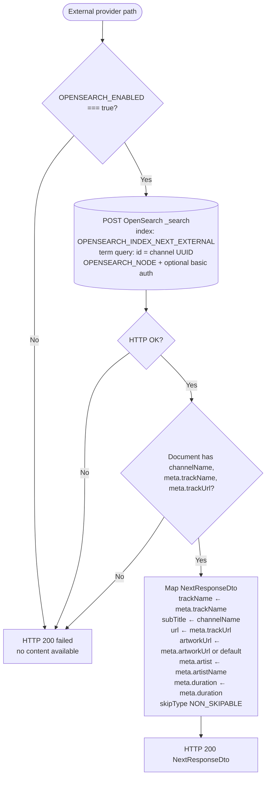
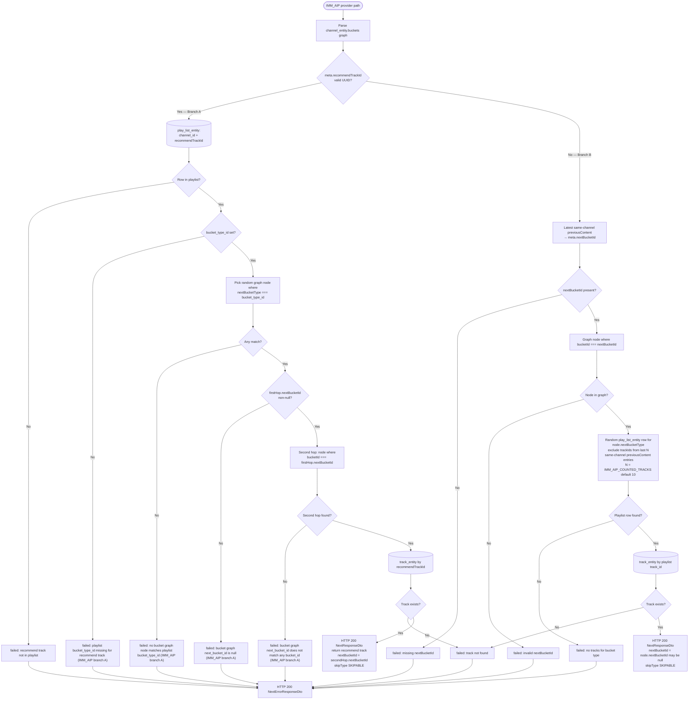

# Functionality

Global API prefix: **`/api/v1`**. Swagger UI: **`/api/docs`**. Validation: global `ValidationPipe` with `transform: true` (`src/main.ts`).

## `GET /api/v1/health`

- **HTTP:** Always **200**.
- **Body:** `status` (`ok` \| `degraded`), `database` (`ok` \| `down`), `opensearch` (`ok` \| `down - OpenSearch is down` \| `down - resource not found`), `timestamp` (ISO-8601).
- **DB:** `select 1` via MikroORM.
- **OpenSearch:** checks `GET /_cluster/health` and then `HEAD /{OPENSEARCH_INDEX_NEXT_EXTERNAL}` using `OPENSEARCH_NODE` plus optional basic auth from `OPENSEARCH_USERNAME` / `OPENSEARCH_PASSWORD`.
- **Overall status:** `ok` only when both `database` and `opensearch` are `ok`; otherwise `degraded`.
- **When OpenSearch disabled/unreachable:** `opensearch` is `down - OpenSearch is down`.
- **When index missing:** `opensearch` is `down - resource not found`.

## `POST /api/v1/next` (Phase 3.1 + 3B + IMMEDIA channel)

- **HTTP:** Always **200** (success payload or soft failure).
- **Validation:** Malformed body / failed `class-validator` rules → **400** (unchanged).

### Request (`NextRequestDto`)

| Field | Notes |
|-------|--------|
| `contentType` | Root item: `channel` \| `aidj` \| `audiobook` |
| `id` | UUID; for `channel`, must match `channel_entity.id` |
| `meta` | Object (opaque). IMM_AIP Branch A uses optional `recommendTrackId`. IMMEDIA channel supports filters `explicit` (bool), `news` (bool), `traffic` (bool), `isPremium` (bool), `location` (UUID), `brands` (UUID), `thumbsDown` (UUID[]). |
| `previousContent` | Array of items with the same three fields. IMM_AIP Branch B reads `nextBucketId` from latest same-channel `previousContent[].meta.nextBucketId` and excludes recent same-channel `trackId` values (`IMM_AIP_COUNTED_TRACKS` window). IMMEDIA reads the latest same-channel `previousContent[].meta.trackId` as cursor for next-rank progression. |

### Success response (`NextResponseDto`)

| Field | Notes |
|-------|--------|
| `contentType` | Echoes request `contentType` (or always `channel` on channel path) |
| `id` | Echoes request `id` |
| `trackName`, `subTitle`, `url`, `artworkUrl` | Non-`channel`: hardcoded fruit prototype. External providers: `trackName` from `meta.trackName`, `subTitle` from OpenSearch `channelName`, `url` from `meta.trackUrl`, `artworkUrl` from `meta.artworkUrl`. IMM_AIP/IMMEDIA: `trackName`/`url` from `track_entity`, `artworkUrl` from `channel_entity.artwork_url`. |
| `meta` | External providers return `{ artist, duration, skipType: "NON_SKIPABLE" }`. IMM_AIP returns `{ trackId, nextBucketId, artist, duration, skipType: "SKIPABLE" }`. IMMEDIA returns `{ trackId, artist, duration, skipType: "SKIPABLE" }`. |

### Soft failure response (`NextErrorResponseDto`)

Minimal body only:

- `{ "status": "failed", "message": "id not found" }` — no row for `channel` + `id`
- `{ "status": "failed", "message": "unsupported provider" }` — row exists but normalized `provider_entity.name` is not one of: `IHEARTMUSIC`, `SIRIUSXM`, `TUNEIN`, `IMM_AIP`, `IMMEDIA`
- `{ "status": "failed", "message": "no content available" }` — supported external provider but no valid OpenSearch track snapshot found
- IMM_AIP detailed failures:
  - `{ "status": "failed", "message": "recommend track not in playlist" }`
  - `{ "status": "failed", "message": "missing nextBucketId" }`
  - `{ "status": "failed", "message": "invalid nextBucketId" }`
  - Branch A graph / playlist mismatches:
    - `{ "status": "failed", "message": "playlist bucket_type_id missing for recommend track (IMM_AIP branch A)" }`
    - `{ "status": "failed", "message": "no bucket graph node matches playlist bucket_type_id (IMM_AIP branch A)" }`
    - `{ "status": "failed", "message": "bucket graph next_bucket_id is null (IMM_AIP branch A)" }`
    - `{ "status": "failed", "message": "bucket graph next_bucket_id does not match any bucket_id (IMM_AIP branch A)" }`
  - `{ "status": "failed", "message": "no tracks for bucket type" }`
  - `{ "status": "failed", "message": "track not found" }`

### Behaviour summary

1. **`contentType` ≠ `channel`:** no DB read; fruit-themed hardcoded `NextResponseDto`; `meta` is an empty object.
2. **`contentType` === `channel`:** SQL join `channel_entity` → `provider_entity`; normalize provider name and route by provider.
3. **Supported external provider:** query OpenSearch by channel `id` only (index set by `OPENSEARCH_INDEX_NEXT_EXTERNAL`, e.g. `now_playing_service_v1`) and map response as:
   - `trackName <- meta.trackName`
   - `subTitle <- channelName`
   - `url <- meta.trackUrl`
   - `artworkUrl <- meta.artworkUrl`
   - `meta <- { artist: meta.artistName, duration: meta.duration, skipType: "NON_SKIPABLE" }`
4. **OpenSearch miss/invalid track:** return soft-fail `no content available`.
5. **IMM_AIP Branch A (first play):** use `meta.recommendTrackId`, find playlist `bucket_type_id`, traverse buckets (`nextBucketType` match, then second-hop `bucketId`), return recommend track with derived `nextBucketId`. `channel_entity.buckets` may be stored as a top-level `[{bucketId,...}]` array or `{ "buckets": [...] }`; both shapes are parsed.
6. **IMM_AIP Branch B (continued):** read `nextBucketId` from latest same-channel `previousContent[].meta.nextBucketId`, resolve bucket + `nextBucketType`, pick random playlist track for that bucket type while excluding recent same-channel `previousContent[].meta.trackId` values (last `IMM_AIP_COUNTED_TRACKS`), return new `nextBucketId` (nullable for terminal).
7. **IMMEDIA channel:** read filters from request `meta`, build filtered playlist from `play_list_entity` + `track_entity`, and use latest same-channel `previousContent[].meta.trackId` as cursor:
   - when cursor track is found in channel playlist: choose next filtered track by ascending `rank`, with wraparound to smallest rank
   - when no previous same-channel cursor exists: choose random filtered track
   - when cursor track is not found in channel playlist: choose random filtered track
   Location/brand filters use UUID equality on join tables (`track_entity_locations.location_entity_id`, `track_entity_brands.brand_entity_id`).

### Flow diagrams (`/next` channel providers)

These diagrams cover the three **channel** provider paths after shared entry steps:

1. Request passes validation (`ValidationPipe`); invalid body → **400**.
2. `contentType` must be `channel` (non-channel paths return hardcoded prototypes; not shown below).
3. `channel_entity` joined to `provider_entity` by `request.id`; missing row → **200** `id not found`.
4. `provider_entity.name` is uppercased and routed to one of the flows below; anything else → **200** `unsupported provider`.

Implementation: `src/modules/next/next.service.ts`.

#### 1. External providers (`IHEARTMUSIC`, `SIRIUSXM`, `TUNEIN`)

`request.meta` and `previousContent` are **not** used. Track data comes from OpenSearch only ([`NextOpenSearchService`](../src/modules/next/next-opensearch.service.ts)).



#### 2. IMMEDIA

Filters are read from `request.meta`. Progression uses the **latest** same-channel entry in `previousContent` (`contentType === channel` and `id` matches) → `meta.trackId` as cursor.

| `meta` key | Default | Effect |
|------------|---------|--------|
| `explicit` | `true` | When `false`, exclude explicit tracks |
| `news` | `true` | When `false`, exclude `track_type = news` |
| `traffic` | `true` | When `false`, exclude `track_type = traffic` |
| `isPremium` | `false` | When `true`, exclude `oem_ad` and `ad` track types |
| `location` | — | UUID; include tracks with no location rows or matching `track_entity_locations` |
| `brands` | — | UUID; include tracks with no brand rows or matching `track_entity_brands` |
| `thumbsDown` | `[]` | UUID[]; exclude listed `track_entity.id` values |


#### 3. IMM_AIP

Uses `channel_entity.buckets` (top-level JSON array or `{ "buckets": [...] }`), `play_list_entity`, and `track_entity`.

- **Branch A (first play):** `request.meta.recommendTrackId` is a valid UUID (`track_entity.id`, not `service_track_id`).
- **Branch B (continuation):** no `recommendTrackId`; requires `nextBucketId` from the latest same-channel `previousContent` entry.

- **Relevant .env variables**
```code
IMM_AIP_COUNTED_TRACKS=3 // The number of tracks to check in the users history i.e. previousContent attribute
IMM_AIP_PROVIDER_ID=8de7f839-6038-4e4a-9bd2-473a671b08bf //The UUID of IMM_AIP provider
```



### QA test matrix (`/next`)

| Case | contentType | Channel Id | Provider | Meta values | previousContent | Expected |
|------|-------------|------------|----------|-------------|-----------------|----------|
| External success 1 | `channel` | `bc212eda-8ff0-4d8e-8e4f-4af98b0d463b` | `IHEARTMUSIC` | `{}` | `[]` | 200 success, track from OpenSearch |
| External success 2 | `channel` | `92503af0-3ff0-4910-92c5-15ff44924bf3` | `SIRIUSXM` | `{}` | `[]` | 200 success, track from OpenSearch |
| External success 3 | `channel` | `bee5c48c-d1be-494f-9d97-95de8d5a6b5c` | `TUNEIN` | `{}` | `[]` | 200 success, track from OpenSearch |
| External no content | `channel` | any valid external channel UUID | `IHEARTMUSIC` / `SIRIUSXM` / `TUNEIN` | `{}` | `[]` | 200 `{ "status": "failed", "message": "no content available" }` |
| Channel not found | `channel` | `00000000-0000-0000-0000-000000000000` | n/a | `{}` | `[]` | 200 `{ "status": "failed", "message": "id not found" }` |
| Unsupported provider | `channel` | existing UUID with non-supported provider | not in allowed provider set | `{}` | `[]` | 200 `{ "status": "failed", "message": "unsupported provider" }` |
| Non-channel prototype | `aidj` (or `audiobook`) | any UUID | n/a | `{}` | `[]` | 200 prototype response path |
| Validation failure | `channel` | `not-a-uuid` | n/a | `{}` | `[]` | 400 validation error |

## `POST /api/v1/search`

- **HTTP:** **200** on success.
- **Validation:** Malformed body / failed `class-validator` rules → **400**.

### Request (`SearchRequestDto`)

| Field | Notes |
|-------|--------|
| `contentTypes` | Non-empty array; each item is one of `channel` \| `aidj` \| `audiobook` |
| `query` | Required non-empty string (trimmed before validation) used for case-insensitive matching |

### Response (`SearchResponseDto`)

| Field | Notes |
|-------|--------|
| `results` | Array of `SearchResultItemDto` |

Each result item contains:

- `contentType`: `channel` \| `aidj` \| `audiobook`
- `id`: UUID
- `name`: Display name
- `url`: stream/detail URL
- `genres`: array of `{ genreId }` where `genreId` can be numeric or UUID-shaped string based on source data
- `meta`: object

### Behaviour summary

1. If `contentTypes` includes `channel`, the service queries `channel_entity` where `name ilike %query%`, `deleted_at is null`, ordered by `rank`, `name`, and limited to 25 rows.
2. Channel genres are mapped from `channel_entity_genres`.
3. If `contentTypes` includes `aidj`, one hardcoded prototype result is appended.
4. If `contentTypes` includes `audiobook`, one hardcoded prototype result is appended.
5. Empty/whitespace-only `query` fails validation (400).

Seeded external provider fixtures in `src/modules/next/scripts/seed-external-opensearch.ts`:

- `IHEARTMUSIC`: `bc212eda-8ff0-4d8e-8e4f-4af98b0d463b`, `af58bf00-73c0-40fe-999d-990e8cfa78bc`, `56850567-e1e1-4e7b-b47c-32db522c6584`, `474a3099-4a77-443e-b8e0-6f9a154057b9`
- `SIRIUSXM`: `92503af0-3ff0-4910-92c5-15ff44924bf3`, `23e56cef-2a32-41cf-a6ed-47aa52071f8f`, `8bdd19c6-6744-4352-933d-462f6e1fe90b`, `3639bbb0-0040-4f2c-9053-4af4dd8b2631`
- `TUNEIN`: `bee5c48c-d1be-494f-9d97-95de8d5a6b5c`, `1c5fb463-71d3-4f2d-a2ec-00980d37736b`, `4a54e8c6-8c61-4f04-b420-d6425827f4c3`, `1200a870-5815-485e-9c6e-f907a2296145`

## Quick curl

```bash
curl -sS "http://localhost:${PORT:-3000}/api/v1/health"
```

```bash
curl -sS -X POST "http://localhost:${PORT:-3000}/api/v1/next" \
  -H "Content-Type: application/json" \
  -d '{"contentType":"channel","id":"550e8400-e29b-41d4-a716-446655440000","meta":{},"previousContent":[]}'
```

```bash
curl -sS -X POST "http://localhost:${PORT:-3000}/api/v1/next" \
  -H "Content-Type: application/json" \
  -d '{"contentType":"aidj","id":"550e8400-e29b-41d4-a716-446655440000","meta":{},"previousContent":[]}'
```
